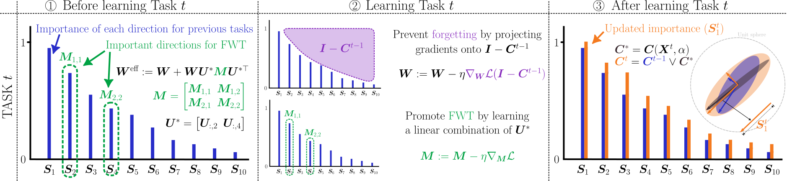

# CODE-CL: Conceptor-Based Gradient Projection for Deep Continual Learning

This repository is the official implementation of CODE-CL, a conceptor-based gradient projection method for deep continual learning, and replicates the experimental results obtained on the SplitCIFAR100, SplitMiniIMAGENET, and  5-Dataset benchmarks. Its primary purpose is to aid in understanding the methodology and reproduce essential results. This work has been accepted at **the International Conference on Computer Vision, ICCV 2025**.

[[arXiv Paper]](https://arxiv.org/abs/2411.15235)

## Abstract
Continual learning (CL) — the ability to progressively acquire and integrate new concepts — is essential to intelligent systems to adapt to dynamic environments. However, deep neural networks struggle with catastrophic forgetting (CF) when learning tasks sequentially, as training for new tasks often overwrites previously learned knowledge. To address this, recent approaches constrain updates to orthogonal subspaces using gradient projection, effectively preserving important gradient directions for previous tasks. While effective in reducing forgetting, these approaches inadvertently hinder forward knowledge transfer (FWT), particularly when tasks are highly correlated. In this work, we propose Conceptor-based gradient projection for Deep Continual Learning (CODE-CL), a novel method that leverages conceptor matrix representations, a form of regularized reconstruction, to adaptively handle highly correlated tasks. CODE-CL mitigates CF by projecting gradients onto pseudo-orthogonal subspaces of previous task feature spaces while simultaneously promoting FWT. It achieves this by learning a linear combination of shared basis directions, allowing efficient balance between stability and plasticity and transfer of knowledge between overlapping input feature representations. Extensive experiments on continual learning benchmarks validate CODE-CL’s efficacy, demonstrating superior performance, reduced forgetting, and improved FWT as compared to state-of-the-art methods.

<p align = "center">

</p>
<p align = "center">
Overview of CODE-CL.
</p>

## How to Use

1. Install the required dependencies listed in `requirements.txt`. 
2. Use the following command to run an experiment:

    ```shell
    python main.py --param-name param_value
    ```

    A description of each parameter is provided in `./utils/args.py`.

## Reproducing Results in the Paper

To ensure reproducibility, we have provided a bash script (`./script.sh`) with all the commands used to obtain the results reported in the paper.

## Citation

If you use this code in your research, please cite our paper:

```bibtex
@misc{apolinario2025codecl,
      title={CODE-CL: Conceptor-Based Gradient Projection for Deep Continual Learning}, 
      author={Marco Paul E. Apolinario and Sakshi Choudhary and Kaushik Roy},
      year={2025},
      eprint={2411.15235},
      archivePrefix={arXiv},
      primaryClass={cs.LG},
      url={https://arxiv.org/abs/2411.15235}, 
}
```